# MotorTrace Backend Architecture Diagram

## Overview
This document provides a comprehensive architectural overview of the MotorTrace backend system, focusing on the modular structure and layered design.

## Architecture Diagram

```mermaid
graph TB
    %% External Systems
    subgraph "External Systems"
        SUPABASE[Supabase<br/>Auth & Storage]
        POSTGRES[(PostgreSQL<br/>Database)]
        REDIS[(Redis<br/>Cache)]
        EMAIL[Email Service<br/>Nodemailer]
        SMS[SMS Service]
        PAYMENT[Payment Gateway<br/>Stripe]
        STORAGE[File Storage<br/>Supabase Storage]
    end

    %% Presentation Layer
    subgraph "Presentation Layer"
        subgraph "API Gateway & Middleware"
            EXPRESS[Express.js<br/>Server]
            CORS[CORS<br/>Middleware]
            AUTH_MW[Supabase Auth<br/>Middleware]
            ROLE_MW[Role-based Auth<br/>Middleware]
            VALIDATION[Request<br/>Validation]
            ERROR_MW[Error Handling<br/>Middleware]
            LOGGER[Logging<br/>Middleware]
        end

        subgraph "API Documentation"
            SWAGGER[Swagger UI<br/>API Docs]
        end
    end

    %% Business Logic Layer
    subgraph "Business Logic Layer"
        subgraph "Core Modules"
            AUTH[Auth Module<br/>Supabase Integration]
            USERS[Users Module<br/>Profile Management]
            CUSTOMERS[Customers Module<br/>Customer Data]
            VEHICLES[Vehicles Module<br/>Vehicle Management]
            WORK_ORDERS[Work Orders Module<br/>Service Orders]
            APPOINTMENTS[Appointments Module<br/>Scheduling]
        end

        subgraph "Service Modules"
            LABOR[Labor Module<br/>Labor Operations]
            INVENTORY[Inventory Module<br/>Parts Management]
            INSPECTIONS[Inspection Templates<br/>Diagnostic System]
            PAYMENTS[Payments Module<br/>Billing]
            INVOICES[Invoices Module<br/>Document Generation]
            STORAGE_MOD[Storage Module<br/>File Management]
        end

        subgraph "Specialized Modules"
            CANNED_SERVICES[Canned Services<br/>Standard Services]
            SERVICE_ADVISORS[Service Advisors<br/>Advisor Management]
            TECHNICIANS[Technicians Module<br/>Tech Operations]
            MILEAGE_TRACKING[Mileage Tracking<br/>Vehicle Monitoring]
            SERVICE_RECOMMENDATIONS[Service Recommendations<br/>AI Suggestions]
            CAR_EXPENSES[Car Expenses<br/>Cost Tracking]
            NOTIFICATIONS[Notifications<br/>Communication]
        end
    end

    %% Data Access Layer
    subgraph "Data Access Layer"
        PRISMA[Prisma ORM<br/>Database Client]
        MIGRATIONS[Database<br/>Migrations]
        SEEDERS[Data<br/>Seeders]
    end

    %% Infrastructure Layer
    subgraph "Infrastructure Layer"
        CACHE[Redis Cache<br/>Service]
        EMAIL_SVC[Email Service<br/>Templates & Sending]
        SMS_SVC[SMS Service<br/>Notifications]
        PAYMENT_SVC[Payment Processing<br/>Stripe Integration]
        FILE_UPLOAD[File Upload<br/>Service]
        BACKGROUND_JOBS[Background Jobs<br/>Queue System]
    end

    %% Shared Components
    subgraph "Shared Components"
        UTILS[Utility Functions<br/>Helpers]
        TYPES[Type Definitions<br/>TypeScript Types]
        CONSTANTS[Constants<br/>Enums & Config]
        VALIDATION_SCHEMAS[Validation Schemas<br/>Joi/Zod]
        ERROR_HANDLING[Custom Errors<br/>Error Classes]
        MIDDLEWARE[Shared Middleware<br/>Common Logic]
    end

    %% Testing Layer
    subgraph "Testing Layer"
        UNIT_TESTS[Unit Tests<br/>Jest]
        INTEGRATION_TESTS[Integration Tests<br/>API Testing]
        TEST_FIXTURES[Test Fixtures<br/>Mock Data]
        TEST_HELPERS[Test Helpers<br/>Utilities]
    end

    %% Connections
    EXPRESS --> AUTH
    EXPRESS --> USERS
    EXPRESS --> CUSTOMERS
    EXPRESS --> VEHICLES
    EXPRESS --> WORK_ORDERS
    EXPRESS --> APPOINTMENTS
    EXPRESS --> LABOR
    EXPRESS --> INVENTORY
    EXPRESS --> INSPECTIONS
    EXPRESS --> PAYMENTS
    EXPRESS --> INVOICES
    EXPRESS --> STORAGE_MOD
    EXPRESS --> CANNED_SERVICES
    EXPRESS --> SERVICE_ADVISORS
    EXPRESS --> TECHNICIANS
    EXPRESS --> MILEAGE_TRACKING
    EXPRESS --> SERVICE_RECOMMENDATIONS
    EXPRESS --> CAR_EXPENSES
    EXPRESS --> NOTIFICATIONS

    AUTH --> SUPABASE
    STORAGE_MOD --> SUPABASE
    AUTH_MW --> SUPABASE

    PRISMA --> POSTGRES
    CACHE --> REDIS

    EMAIL_SVC --> EMAIL
    SMS_SVC --> SMS
    PAYMENT_SVC --> PAYMENT
    FILE_UPLOAD --> STORAGE

    AUTH --> PRISMA
    USERS --> PRISMA
    CUSTOMERS --> PRISMA
    VEHICLES --> PRISMA
    WORK_ORDERS --> PRISMA
    APPOINTMENTS --> PRISMA
    LABOR --> PRISMA
    INVENTORY --> PRISMA
    INSPECTIONS --> PRISMA
    PAYMENTS --> PRISMA
    INVOICES --> PRISMA
    CANNED_SERVICES --> PRISMA
    SERVICE_ADVISORS --> PRISMA
    TECHNICIANS --> PRISMA
    MILEAGE_TRACKING --> PRISMA
    SERVICE_RECOMMENDATIONS --> PRISMA
    CAR_EXPENSES --> PRISMA
    NOTIFICATIONS --> PRISMA

    UNIT_TESTS --> AUTH
    UNIT_TESTS --> USERS
    INTEGRATION_TESTS --> EXPRESS

    %% Styling
    classDef external fill:#e1f5fe,stroke:#01579b,stroke-width:2px
    classDef presentation fill:#f3e5f5,stroke:#4a148c,stroke-width:2px
    classDef business fill:#e8f5e8,stroke:#1b5e20,stroke-width:2px
    classDef data fill:#fff3e0,stroke:#e65100,stroke-width:2px
    classDef infrastructure fill:#fce4ec,stroke:#880e4f,stroke-width:2px
    classDef shared fill:#f9fbe7,stroke:#827717,stroke-width:2px
    classDef testing fill:#efebe9,stroke:#3e2723,stroke-width:2px

    class SUPABASE,POSTGRES,REDIS,EMAIL,SMS,PAYMENT,STORAGE external
    class EXPRESS,CORS,AUTH_MW,ROLE_MW,VALIDATION,ERROR_MW,LOGGER,SWAGGER presentation
    class AUTH,USERS,CUSTOMERS,VEHICLES,WORK_ORDERS,APPOINTMENTS,LABOR,INVENTORY,INSPECTIONS,PAYMENTS,INVOICES,STORAGE_MOD,CANNED_SERVICES,SERVICE_ADVISORS,TECHNICIANS,MILEAGE_TRACKING,SERVICE_RECOMMENDATIONS,CAR_EXPENSES,NOTIFICATIONS business
    class PRISMA,MIGRATIONS,SEEDERS data
    class CACHE,EMAIL_SVC,SMS_SVC,PAYMENT_SVC,FILE_UPLOAD,BACKGROUND_JOBS infrastructure
    class UTILS,TYPES,CONSTANTS,VALIDATION_SCHEMAS,ERROR_HANDLING,MIDDLEWARE shared
    class UNIT_TESTS,INTEGRATION_TESTS,TEST_FIXTURES,TEST_HELPERS testing
```

## Architectural Layers Explanation

### 1. External Systems Layer
- **Supabase**: Authentication, real-time subscriptions, and file storage
- **PostgreSQL**: Primary database using Prisma ORM
- **Redis**: Caching layer for performance optimization
- **Third-party Services**: Email (Nodemailer), SMS, Payment (Stripe), File storage

### 2. Presentation Layer
- **Express.js Server**: Main web framework handling HTTP requests
- **Middleware Stack**: CORS, authentication, authorization, validation, error handling
- **API Documentation**: Swagger UI for interactive API documentation

### 3. Business Logic Layer
Organized into 19 specialized modules, each handling specific domain logic:

**Core Business Modules:**
- Auth, Users, Customers, Vehicles, Work Orders, Appointments

**Service Operation Modules:**
- Labor, Inventory, Inspections, Payments, Invoices, Storage

**Specialized Modules:**
- Canned Services, Service Advisors, Technicians, Mileage Tracking, Service Recommendations, Car Expenses, Notifications

### 4. Data Access Layer
- **Prisma ORM**: Type-safe database access with schema management
- **Migrations**: Database schema versioning and updates
- **Seeders**: Initial data population for development/testing

### 5. Infrastructure Layer
- **Caching**: Redis for session management and performance
- **Communication Services**: Email templates, SMS notifications
- **Payment Processing**: Stripe integration for billing
- **File Management**: Upload handling and storage operations
- **Background Jobs**: Asynchronous task processing

### 6. Shared Components
- **Utilities**: Common helper functions and utilities
- **Type Definitions**: TypeScript interfaces and types
- **Constants**: Application-wide enums and configuration
- **Validation Schemas**: Request/response validation rules
- **Error Handling**: Custom error classes and handling logic
- **Middleware**: Reusable middleware components

### 7. Testing Layer
- **Unit Tests**: Individual component testing with Jest
- **Integration Tests**: API endpoint testing
- **Test Fixtures**: Mock data and test scenarios
- **Test Helpers**: Testing utility functions

## Key Design Principles

1. **Modular Architecture**: Each module is self-contained with its own routes, controllers, services, and types
2. **Layered Separation**: Clear separation between presentation, business logic, data access, and infrastructure
3. **Dependency Injection**: Clean dependencies with proper abstraction layers
4. **Type Safety**: Full TypeScript implementation with strict typing
5. **Scalability**: Modular design allows for easy addition of new features
6. **Maintainability**: Clear code organization and documentation
7. **Testability**: Comprehensive testing strategy with unit and integration tests

## Technology Stack

- **Runtime**: Node.js with TypeScript
- **Framework**: Express.js
- **Database**: PostgreSQL with Prisma ORM
- **Authentication**: Supabase Auth
- **Caching**: Redis
- **Documentation**: Swagger/OpenAPI
- **Testing**: Jest with Supertest
- **Validation**: Joi and Zod schemas
- **Email**: Nodemailer
- **Payments**: Stripe
- **File Storage**: Supabase Storage

This architecture provides a robust, scalable foundation for the MotorTrace automotive service management system.