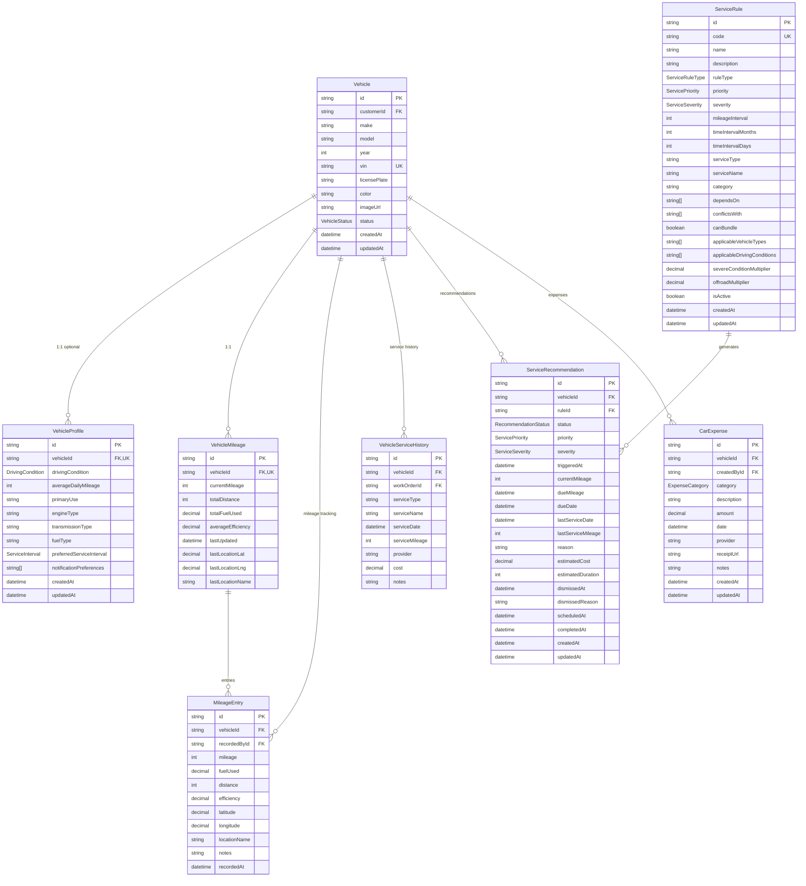

# MotorTrace Backend Database Schema - Focused Diagrams

## Overview
This document provides focused, smaller ER diagrams for specific domains of the MotorTrace backend system to avoid overlapping arrows and improve readability.

## 1. User Management Domain

## 2. Vehicle Management Domain

## 3. Work Order Core Domain

## 4. Appointment & Scheduling Domain

## 5. Inventory & Parts Domain

## 6. Financial Domain

## 7. Communication & Notifications Domain

## Summary

These focused ER diagrams break down the complex database schema into manageable, readable sections:

1. **User Management** - User profiles and staff roles
2. **Vehicle Management** - Vehicles and related tracking
3. **Work Order Core** - Main business transactions
4. **Appointment & Scheduling** - Service booking system
5. **Inventory & Parts** - Parts and labor catalog
6. **Financial** - Payments and invoicing
7. **Communication** - Notifications and file attachments

Each diagram focuses on a specific business domain, eliminating overlapping arrows and providing clear, readable relationship visualizations. This approach is much better for documentation and understanding than one massive diagram.