# MotorTrace Backend - Inventory Manager Use Case Diagram

## Overview
This document contains the use case diagram for the MotorTrace Backend Inventory Management Module, focusing on the Inventory Manager actor and their interactions with the inventory management system. The diagram is based on analysis of the inventory backend module and its comprehensive API endpoints.

## Actors
- **Inventory Manager**: The primary actor who manages the service center's parts inventory, including stock levels, suppliers, and inventory operations

## Use Case Diagram

```mermaid
graph TD
    A[Inventory Manager] --> B[Inventory CRUD Operations]
    A --> C[Stock Management]
    A --> D[Inventory Monitoring]
    A --> E[Reporting & Analytics]
    A --> F[Supplier Management]
    A --> G[Category Management]

    B --> B1[Create Inventory Items]
    B --> B2[View Inventory Items]
    B --> B3[Update Inventory Items]
    B --> B4[Delete Inventory Items]
    B --> B5[Bulk Update Items]

    C --> C1[Adjust Stock Levels]
    C --> C2[Transfer Inventory]
    C --> C3[Set Stock Thresholds]
    C --> C4[Manage Locations]

    D --> D1[Monitor Low Stock]
    D --> D2[Track Out of Stock]
    D --> D3[View Stock Status]
    D --> D4[Get Reorder Suggestions]

    E --> E1[Generate Inventory Reports]
    E --> E2[View Inventory Summary]
    E --> E3[Track Usage Analytics]
    E --> E4[Monitor Work Order Parts]

    F --> F1[Manage Suppliers]
    F --> F2[Track Supplier Parts]
    F --> F3[Update Supplier Information]

    G --> G1[Create Categories]
    G --> G2[Update Categories]
    G --> G3[Delete Categories]
    G --> G4[Organize Items by Category]

    B1 --> B11[Add Item Details]
    B1 --> B12[Set Initial Stock]
    B1 --> B13[Configure Pricing]

    C1 --> C11[Add Stock]
    C1 --> C12[Remove Stock]
    C1 --> C13[Set Stock Quantity]

    D1 --> D11[Configure Reorder Points]
    D1 --> D12[Set Minimum Levels]
    D1 --> D13[Set Maximum Levels]

    E1 --> E11[Export Reports]
    E1 --> E12[Filter Reports]
    E1 --> E13[Schedule Reports]

    F1 --> F11[Add New Suppliers]
    F1 --> F12[Update Supplier Details]
    F1 --> F13[Track Supplier Performance]
```

## Use Case Groups

### 1. Inventory CRUD Operations
**Primary Actor**: Inventory Manager

**Use Cases**:
- **Create Inventory Items**: Inventory Manager can add new parts and supplies to the system
- **View Inventory Items**: Inventory Manager can browse and search inventory with filtering
- **Update Inventory Items**: Inventory Manager can modify item details, pricing, and specifications
- **Delete Inventory Items**: Inventory Manager can remove items from inventory
- **Bulk Update Items**: Inventory Manager can update multiple items simultaneously

**Sub-Use Cases for Item Creation**:
- **Add Item Details**: Inventory Manager can enter comprehensive item information
- **Set Initial Stock**: Inventory Manager can establish starting inventory quantities
- **Configure Pricing**: Inventory Manager can set unit prices and core charges

### 2. Stock Management
**Primary Actor**: Inventory Manager

**Use Cases**:
- **Adjust Stock Levels**: Inventory Manager can modify inventory quantities with audit trail
- **Transfer Inventory**: Inventory Manager can move items between locations
- **Set Stock Thresholds**: Inventory Manager can configure reorder points and stock limits
- **Manage Locations**: Inventory Manager can organize inventory by physical storage locations

**Sub-Use Cases for Stock Adjustments**:
- **Add Stock**: Inventory Manager can increase inventory quantities
- **Remove Stock**: Inventory Manager can decrease inventory quantities
- **Set Stock Quantity**: Inventory Manager can directly set exact stock levels

### 3. Inventory Monitoring
**Primary Actor**: Inventory Manager

**Use Cases**:
- **Monitor Low Stock**: Inventory Manager can identify items approaching reorder points
- **Track Out of Stock**: Inventory Manager can monitor items with zero quantity
- **View Stock Status**: Inventory Manager can see comprehensive stock status (IN_STOCK, LOW_STOCK, OUT_OF_STOCK, OVERSTOCK)
- **Get Reorder Suggestions**: Inventory Manager can receive intelligent restocking recommendations

**Sub-Use Cases for Stock Monitoring**:
- **Configure Reorder Points**: Inventory Manager can set automatic reorder triggers
- **Set Minimum Levels**: Inventory Manager can establish minimum stock requirements
- **Set Maximum Levels**: Inventory Manager can define maximum stock capacities

### 4. Reporting & Analytics
**Primary Actor**: Inventory Manager

**Use Cases**:
- **Generate Inventory Reports**: Inventory Manager can create detailed inventory status reports
- **View Inventory Summary**: Inventory Manager can see overview statistics and totals
- **Track Usage Analytics**: Inventory Manager can monitor item usage patterns and frequency
- **Monitor Work Order Parts**: Inventory Manager can track parts usage in service work

**Sub-Use Cases for Reporting**:
- **Export Reports**: Inventory Manager can export data in various formats
- **Filter Reports**: Inventory Manager can apply filters to focus on specific data
- **Schedule Reports**: Inventory Manager can set up automated report generation

### 5. Supplier Management
**Primary Actor**: Inventory Manager

**Use Cases**:
- **Manage Suppliers**: Inventory Manager can maintain supplier database
- **Track Supplier Parts**: Inventory Manager can associate parts with specific suppliers
- **Update Supplier Information**: Inventory Manager can modify supplier contact details

**Sub-Use Cases for Supplier Operations**:
- **Add New Suppliers**: Inventory Manager can register new supplier relationships
- **Update Supplier Details**: Inventory Manager can modify supplier information
- **Track Supplier Performance**: Inventory Manager can monitor supplier reliability

### 6. Category Management
**Primary Actor**: Inventory Manager

**Use Cases**:
- **Create Categories**: Inventory Manager can establish new inventory categories
- **Update Categories**: Inventory Manager can modify category names and organization
- **Delete Categories**: Inventory Manager can remove unused categories
- **Organize Items by Category**: Inventory Manager can assign items to appropriate categories

## Detailed Use Case Descriptions

### UC-1: Manage Inventory Items
**Actor**: Inventory Manager
**Preconditions**: Inventory Manager is authenticated and has inventory management permissions
**Main Flow**:
1. Inventory Manager accesses inventory management interface
2. System displays current inventory with search and filtering options
3. Inventory Manager can create, view, update, or delete inventory items
4. System validates all changes and maintains audit trail
5. Inventory Manager can perform bulk operations on multiple items
**Postconditions**: Inventory database is updated with accurate item information

### UC-2: Control Stock Levels
**Actor**: Inventory Manager
**Preconditions**: Inventory items exist in the system
**Main Flow**:
1. Inventory Manager selects stock adjustment operation
2. System displays current stock levels and adjustment options
3. Inventory Manager specifies adjustment type (ADD, REMOVE, SET) and quantity
4. System validates stock levels and prevents negative quantities
5. Inventory Manager can transfer items between locations
6. System records all stock movements with audit trail
**Postconditions**: Stock levels are accurately maintained and tracked

### UC-3: Monitor Inventory Health
**Actor**: Inventory Manager
**Preconditions**: Inventory system is operational with stock data
**Main Flow**:
1. Inventory Manager accesses inventory monitoring dashboard
2. System displays low stock alerts and out-of-stock items
3. Inventory Manager reviews reorder suggestions with urgency levels
4. System provides comprehensive stock status categorization
5. Inventory Manager can configure threshold levels for automatic alerts
6. System generates reports on inventory health and trends
**Postconditions**: Inventory Manager has complete visibility into stock status

### UC-4: Generate Inventory Reports
**Actor**: Inventory Manager
**Preconditions**: Inventory data exists in the system
**Main Flow**:
1. Inventory Manager selects reporting options
2. System provides various report types (summary, detailed, usage, work order parts)
3. Inventory Manager applies filters and date ranges
4. System generates comprehensive reports with analytics
5. Inventory Manager can export reports in multiple formats
6. System can schedule automated report generation
**Postconditions**: Inventory Manager receives actionable insights and documentation

### UC-5: Manage Suppliers and Categories
**Actor**: Inventory Manager
**Preconditions**: Inventory Manager has administrative permissions
**Main Flow**:
1. Inventory Manager accesses supplier and category management
2. System displays current suppliers and categories
3. Inventory Manager can add, update, or remove suppliers
4. Inventory Manager can create and organize inventory categories
5. System validates relationships and prevents orphaned data
6. Inventory Manager can track supplier performance metrics
**Postconditions**: Supplier and category data is well-organized and current

## System Boundaries
The Inventory Management system boundary includes:
- Inventory item CRUD operations with comprehensive validation
- Stock level management with audit trails and transaction safety
- Automated monitoring and alerting for stock thresholds
- Advanced reporting and analytics capabilities
- Supplier and category relationship management
- Integration with work order system for parts tracking
- Bulk operations for efficiency with large inventories

External systems include:
- Work order management system for parts usage tracking
- Accounting systems for inventory valuation
- Supplier management systems for automated ordering
- Barcode/QR code systems for inventory tracking
- Mobile applications for real-time inventory updates

## Assumptions
- Inventory Manager has appropriate training and system access
- Database maintains data integrity and audit trails
- Stock adjustments are performed with proper authorization
- Integration with work orders functions correctly
- Supplier and category data remains consistent

## Future Enhancements
- Barcode and QR code integration for rapid inventory scanning
- Automated reorder system with supplier API integration
- Predictive analytics for demand forecasting
- Mobile inventory management application
- RFID integration for automated stock tracking
- Advanced analytics with machine learning for optimization
- Multi-location inventory management
- Integration with accounting software for automated valuation
- Real-time inventory synchronization across multiple locations